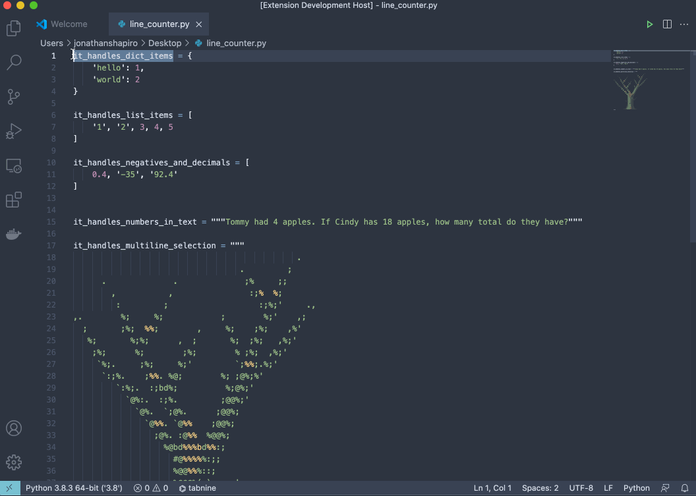

# Line Counter

## Features
VSCode Extension that adds a status bar item detailing:
* Count the selected lines of text
* Calculates Average, Sum and Count of numbers within the text

### Demonstration

Recorded using [LICEcap](https://www.cockos.com/licecap/) / ASCII Art by [asciiart.eu](https://www.asciiart.eu/)

Feel free to [submit issues](https://github.com/shapiroj18/helping-friendly-counter/issues) or [additional features](https://github.com/shapiroj18/helping-friendly-counter/pulls)

## Commands
`Friendly Color` for changing color of the extension

## Known Issues
* Certain numbers will not work with summations:
  * Highlighting text such as `-3-4` reads as an invalid number unless `-3` or `-4` is just highlighted and therefore just shows line count

## Notes
* The name of this extension is an homage to the band [Phish](https://phish.net/) and their Helping Friendly Book.